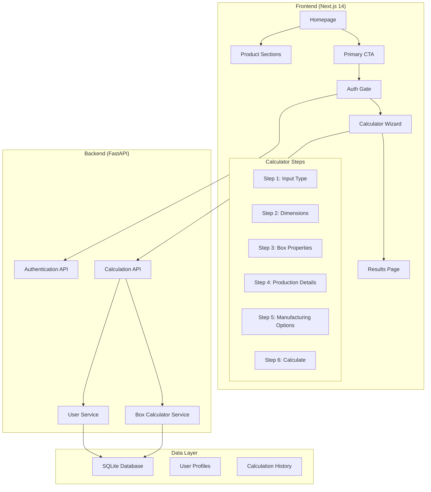

# Design Document

## Overview

The multi-phase website is a comprehensive corrugated box manufacturing platform that guides users through a structured journey from product discovery to detailed cost estimation. The system integrates three distinct phases: discovery/exploration, authentication/calculation, and results/next steps. Built on Next.js 14 with TypeScript and Tailwind CSS, the frontend communicates with an existing FastAPI backend that provides tier-based pricing calculations.

The architecture emphasizes progressive disclosure, where users are gradually introduced to more complex functionality as they demonstrate intent. The system maintains state across the multi-step calculator while providing clear navigation and validation feedback.

## Architecture

### System Architecture



### Component Architecture

The frontend follows a modular component structure:

- **Layout Components**: Navbar, Footer, consistent across all phases
- **Phase Components**: Homepage, AuthGate, Calculator, Results
- **UI Components**: Form inputs, progress indicators, CTAs
- **State Management**: React Context for calculator state, local storage for persistence
- **API Layer**: Custom hooks for backend communication

## Components and Interfaces

### Frontend Components

#### Phase 1: Discovery Components

**Homepage Component**
- Product showcase sections (Custom, Printed, Specialty boxes)
- Hero section with primary CTA
- Material showcase grid
- Service highlights
- Responsive design with mobile-first approach

**ProductSection Component**
- Individual product category displays
- "Learn More" secondary CTAs
- Image galleries with hover effects
- Brief descriptions and key features

#### Phase 2: Authentication & Calculator Components

**AuthGate Component**
- Modal or dedicated page implementation
- Login/signup form with validation
- Integration with backend authentication
- Error handling and user feedback
- Redirect logic post-authentication

**CalculatorWizard Component**
- Multi-step form with progress indicator
- State management across steps
- Dynamic field rendering based on selections
- Form validation and error display
- Navigation controls (Next/Previous)

**Step Components**
- `InputTypeStep`: Radio button selection for input method
- `DimensionsStep`: Conditional form fields based on input type
- `BoxPropertiesStep`: Dynamic dropdown population
- `ProductionDetailsStep`: Conditional field visibility
- `ManufacturingStep`: Flute-type specific options

#### Phase 3: Results Components

**ResultsPage Component**
- Cost display with clear hierarchy
- Action buttons (Save, Contact, New Calculation)
- Cost breakdown visualization
- Order summary information

### Backend Interfaces

#### API Endpoints

**Authentication Endpoints**
```typescript
POST /api/v1/users/login
POST /api/v1/users/register
GET /api/v1/users/profile
```

**Calculation Endpoints**
```typescript
POST /api/v1/calculate/
GET /api/v1/calculate/history/{user_id}
```

#### Data Models

**BoxCalculationRequest Interface**
```typescript
interface BoxCalculationRequest {
  user_id: string;
  input_type: 'sheet_size' | 'box_dimensions';
  sheet_size?: SheetSize;
  box_dimensions: BoxDimensions;
  box_type: BoxType;
  paper_properties: PaperProperties;
  order_details: OrderDetails;
  manufacturing_processes: ManufacturingProcesses;
  costs: Costs;
}
```

**BoxCalculationResponse Interface**
```typescript
interface BoxCalculationResponse {
  user_id: string;
  user_tier: number;
  cost_per_box: number;
  total_order_cost: number;
  manufacturing_cost: number;
  sheet_weight: SheetWeight;
  cost_breakdown: CostBreakdown;
}
```

## Data Models

### Frontend State Models

**CalculatorState**
```typescript
interface CalculatorState {
  currentStep: number;
  inputType: 'sheet_size' | 'box_dimensions';
  boxDimensions: BoxDimensions;
  sheetSize?: SheetSize;
  boxType: BoxType;
  paperProperties: PaperProperties;
  orderDetails: OrderDetails;
  manufacturingProcesses: ManufacturingProcesses;
  isValid: boolean;
  errors: ValidationErrors;
}
```

**UserSession**
```typescript
interface UserSession {
  user_id: string;
  name: string;
  email: string;
  tier: number;
  isAuthenticated: boolean;
  token: string;
}
```

### Dynamic Data Relationships

**Paper Quality to Weight Mapping**
The system maintains dynamic relationships between paper quality selections and available weights:

```typescript
const paperWeightMap = {
  'Kraft': [120, 150, 180, 200],
  'Duplex': [160, 200, 250, 300],
  'Golden': [180, 200, 250],
  // ... additional mappings
};
```

**Flute Type to Options Mapping**
Manufacturing options change based on flute type selection:

```typescript
const fluteOptionsMap = {
  'EF': {
    punching: ['Standard', 'Precision'],
    scoring: ['Light', 'Medium', 'Heavy']
  },
  'NF': {
    punching: ['Standard', 'Heavy-duty'],
    scoring: ['Medium', 'Heavy', 'Extra-heavy']
  }
};
```

## Correctness Properties

*A property is a characteristic or behavior that should hold true across all valid executions of a system-essentially, a formal statement about what the system should do. Properties serve as the bridge between human-readable specifications and machine-verifiable correctness guarantees.*

### Property Reflection

After analyzing all acceptance criteria, several properties can be consolidated to eliminate redundancy:

- Properties 3.3 and 3.4 (conditional UI rendering for input types) can be combined into a single property about input type determining field visibility
- Properties 5.1 and 5.2 (flute type specific options) can be combined into a single property about flute type determining available options
- Properties 6.3, 6.4, and 6.5 (results page buttons) can be combined into a single property about results page containing required action buttons

### Core Properties

**Property 1: CTA button visibility**
*For any* page in the website, the primary "Get an Instant Quote" CTA button should be present and highly visible
**Validates: Requirements 1.3**

**Property 2: Authentication gate enforcement**
*For any* unauthenticated user clicking "Get an Instant Quote", the system should check authentication status and present the Authentication_Gate when needed
**Validates: Requirements 2.1, 2.5**

**Property 3: Calculator progress indication**
*For any* calculator step, the progress indicator should display the correct step number in the format "Step X of 6"
**Validates: Requirements 3.1**

**Property 4: Calculator navigation consistency**
*For any* calculator step, both "Next" and "Previous" navigation buttons should be available (except first/last steps)
**Validates: Requirements 3.2**

**Property 5: Dynamic paper weight population**
*For any* paper quality selection, the paper weight dropdown should be populated with only the weights corresponding to that quality
**Validates: Requirements 3.5**

**Property 6: Input type determines field visibility**
*For any* input type selection in step 1, step 2 should display only the fields corresponding to that input type (box dimensions or sheet size)
**Validates: Requirements 3.3, 3.4**

**Property 7: Ply number validation**
*For any* ply number input, the system should accept odd numbers and reject even numbers with appropriate error messages
**Validates: Requirements 4.3**

**Property 8: Form progression enablement**
*For any* calculator step with valid data, the system should enable progression to the next step
**Validates: Requirements 4.4, 5.4**

**Property 9: Form validation blocking**
*For any* invalid form data, the system should prevent submission and highlight validation errors
**Validates: Requirements 4.5**

**Property 10: Flute type determines options**
*For any* flute type selection, the system should display only the punching/scoring options specific to that flute type
**Validates: Requirements 5.1, 5.2**

**Property 11: Session state persistence**
*For any* user selections during the calculator session, the data should persist when navigating between steps
**Validates: Requirements 5.3, 8.3**

**Property 12: API request formatting**
*For any* calculator form submission, the system should generate a properly formatted BoxCalculationRequest matching the backend API schema
**Validates: Requirements 5.5, 7.1**

**Property 13: Results display consistency**
*For any* successful API response, the results page should display both cost per box and total order cost prominently
**Validates: Requirements 6.1, 6.2**

**Property 14: API response parsing**
*For any* valid API response, the system should correctly parse the JSON and extract all cost breakdown information
**Validates: Requirements 7.3**

**Property 15: Navigation consistency**
*For any* page in the website, consistent navigation and branding elements should be maintained
**Validates: Requirements 8.1**

**Property 16: Form feedback responsiveness**
*For any* form interaction, the system should provide immediate visual feedback for validation states
**Validates: Requirements 8.2**

**Property 17: Loading state indication**
*For any* loading operation, the system should display appropriate progress indicators
**Validates: Requirements 8.5**

## Error Handling

### Frontend Error Handling

**Authentication Errors**
- Invalid credentials: Display clear error messages with retry options
- Session expiration: Redirect to authentication with context preservation
- Network failures: Show offline indicators with retry mechanisms

**Form Validation Errors**
- Real-time validation with immediate feedback
- Field-level error messages with clear correction guidance
- Form-level validation preventing submission of invalid data
- Accessibility-compliant error announcements

**API Communication Errors**
- Network timeouts: Retry logic with exponential backoff
- Server errors: User-friendly error messages with support contact
- Invalid responses: Graceful degradation with fallback options
- Rate limiting: Queue requests with user notification

**Calculator State Errors**
- Invalid step transitions: Prevent navigation with validation
- Data corruption: State recovery from localStorage backup
- Browser compatibility: Feature detection with polyfills

### Backend Error Handling

**Calculation Errors**
- Invalid input parameters: Detailed validation error responses
- Mathematical errors: Fallback calculations with warnings
- Configuration errors: Admin notifications with user-friendly messages

**Database Errors**
- Connection failures: Retry logic with circuit breaker pattern
- Data integrity issues: Transaction rollback with error logging
- Performance issues: Query optimization with caching

## Testing Strategy

### Dual Testing Approach

The testing strategy employs both unit testing and property-based testing to ensure comprehensive coverage:

**Unit Testing**
- Specific examples demonstrating correct behavior
- Edge cases and error conditions
- Integration points between components
- User interaction flows

**Property-Based Testing**
- Universal properties verified across all inputs
- Dynamic behavior validation
- State consistency checks
- API contract compliance

### Testing Framework Selection

**Frontend Testing**
- **Jest** for unit testing React components
- **React Testing Library** for component integration testing
- **fast-check** for property-based testing in TypeScript
- **Cypress** for end-to-end user journey testing

**Backend Testing**
- **pytest** for unit testing Python services
- **Hypothesis** for property-based testing in Python
- **FastAPI TestClient** for API endpoint testing

### Property-Based Testing Configuration

- Each property-based test configured to run minimum 100 iterations
- Custom generators for domain-specific data (box dimensions, paper qualities, user tiers)
- Shrinking enabled to find minimal failing examples
- Seed preservation for reproducible test failures

### Test Organization

**Frontend Test Structure**
```
__tests__/
├── components/
│   ├── Calculator.test.tsx
│   ├── AuthGate.test.tsx
│   └── Results.test.tsx
├── properties/
│   ├── calculator-properties.test.ts
│   ├── navigation-properties.test.ts
│   └── api-properties.test.ts
└── integration/
    ├── user-journey.test.ts
    └── api-integration.test.ts
```

**Backend Test Structure**
```
tests/
├── unit/
│   ├── test_box_calculator.py
│   ├── test_user_service.py
│   └── test_api_endpoints.py
├── properties/
│   ├── test_calculation_properties.py
│   ├── test_tier_pricing_properties.py
│   └── test_validation_properties.py
└── integration/
    └── test_api_integration.py
```

### Test Data Management

**Generators for Property Testing**
- Box dimension generators with realistic constraints
- Paper quality/weight combination generators
- User tier generators with valid ranges
- API response generators matching schema

**Mock Data for Unit Testing**
- Predefined calculation scenarios
- Authentication state fixtures
- API response fixtures
- Error condition simulations

### Continuous Integration

**Test Execution Pipeline**
1. Unit tests (fast feedback)
2. Property-based tests (comprehensive coverage)
3. Integration tests (system behavior)
4. End-to-end tests (user experience)

**Quality Gates**
- 90% code coverage requirement
- All property tests passing with 100+ iterations
- Performance benchmarks for calculator operations
- Accessibility compliance validation